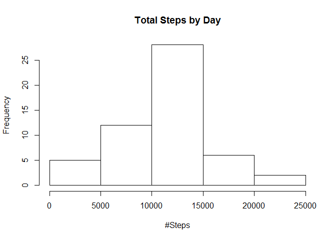
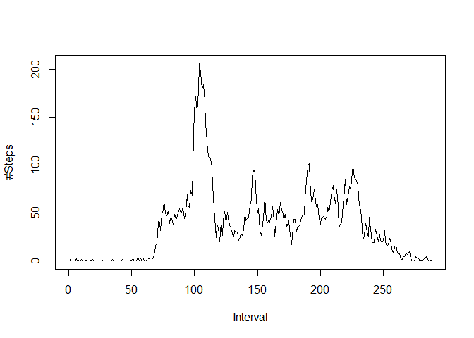
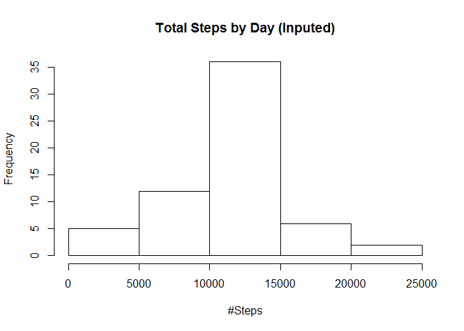
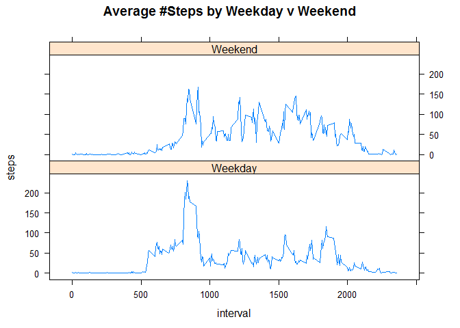

# PA1_template
Herman Crank  
Sunday, April 19, 2015  
#Assignment 
Generate a report using R makrdown and Knitr to demonstrate basis understanding of reproducible research.  Push your completed work to a Github repository, provide both the repo URL and SSA-1 commit ID.

##Loading and preprocessing the data
1. Retrieve date from cloudfront.net
2. Unzip file 
3. Read data into activity dataframe


```r
setInternet2(use = TRUE)
fileUrl <- "https://d396qusza40orc.cloudfront.net/repdata%2Fdata%2Factivity.zip"
download.file(fileUrl, destfile = "activity.zip")
unzip("activity.zip","activity.csv",overwrite=T)
activity <- read.csv("activity.csv",colClasses=c(NA,"Date",NA))
```

##What is mean total number of steps taken per day?
For this part ignore missing values.  Calculate number of steps taken per day. Generate a histogram(not barplot) of the number of steps taken per day.  Finally calculate means and median of the total number of steps taken per day.

1. Eliminate NA values
2. Split data by day
3. Summarize steps by day


```r
activity2 <- subset(activity, complete.cases(activity)=="TRUE")
ActbyDay <- split(activity2,activity2$date)
ActbyDay2 <- sapply(ActbyDay, function(x) sum(x$steps))
```
### Histogram Plot

```r
hist(ActbyDay2, main="Total Steps by Day", xlab="#Steps")
```

 

### Mean, median and quartile distrbution

```r
summary(ActbyDay2)
```

```
##    Min. 1st Qu.  Median    Mean 3rd Qu.    Max. 
##      41    8841   10760   10770   13290   21190
```

##What is the average daily activity pattern?
For this part calculate the average number of steps taken over the 5 minute intervals.  Generate a time series plot and determine the 5 minute interval with the maximum number of avarage steps. 

1. Eliminate NA values
2. Split data by interval
3. Summarize steps by interval


```r
ActbyInt <- split(activity2,activity2$interval)
ActbyInt2 <- sapply(ActbyInt, function(x) mean(x$steps))
```
### Time series Plot

```r
plot(ActbyInt2, type="l", ylab="#Steps", xlab="Interval") 
```

 

### Maximum value interval

```r
names(which.max(ActbyInt2))
```

```
## [1] "835"
```

## Imputing missing values
For this part reduced bias that maybe caused by missing values.  Using a model that imputes the average number of steps (for a given interval) for missing values, create a histogram of the total number steps taken per day and calulate the mean and median for the total number of steps per day. Determine the impact of the imputed data. 

1. Calculate number of missing values
2. Split data by missing values
3. Assign missing values average number steps taken for interval
4. Unsplit data and order by day + interval
5. Split data by day
6. Summarize steps by day

### Number of missing values

```r
ActbyNA <- complete.cases(activity)
NArows <- length(ActbyNA[ActbyNA=="FALSE"])
NArows
```

```
## [1] 2304
```

##  Impute missing values

```r
ActbyNA2 <- cbind(activity, ActbyNA)
ActbyNA3 <- split(ActbyNA2, ActbyNA2$ActbyNA)
for (row in 1:nrow(ActbyNA3[["FALSE"]])){
        ActbyNA3[["FALSE"]][row,1] <- round(subset(ActbyInt2,names(ActbyInt2)== 
                                                   ActbyNA3[["FALSE"]][row,3]))
}

newactivity <- rbind(ActbyNA3[["FALSE"]],ActbyNA3[["TRUE"]])
newactivity <- newactivity[order(newactivity$date, newactivity$interval),]
```

### Histogram Plot

```r
newActbyDay <- split(newactivity,newactivity$date)
newActbyDay2 <- sapply(newActbyDay, function(x) sum(x$steps))
hist(newActbyDay2, main="Total Steps by Day (Inputed)", xlab="#Steps")
```

 

### Mean, median and quartile distrbution

```r
summary(newActbyDay2)
```

```
##    Min. 1st Qu.  Median    Mean 3rd Qu.    Max. 
##      41    9819   10760   10770   12810   21190
```
### Impact of imputed data
The imputed data does not impact the mean or median. The frequency of the center bar has increased.

##Are there differences in activity patterns between weekdays and weekends?
For this part deteremine if there are differences between weekdays and weekend activities.  Create a time series panel plot showing the difference between weekday and weekend steps per interval.

1. Set IsWeekend indicator using weekday function
2. Aggregate steps by weekend indicator and interval
3. Plot weekday and weekend time series of the average number steps taken


```r
newactivity$IsWeekend <- weekdays(newactivity$date) %in% c('Sunday','Saturday')
newact2 <- aggregate(steps ~ interval + IsWeekend, newactivity, mean)
```

### Time Series Plot

```r
library(lattice)
xyplot(steps~interval|factor(IsWeekend,labels=c("Weekday","Weekend")), type="l", 
       data=newact2, main="Average #Steps by Weekday v Weekend", 
       layout=(c(1,2)))
```

 

### Differences between weekday and weekend
During the weekday this individual does most of his/her walking early in the day but very little walking throughout the day.  Durng the weekend this person is consistently more 'active' throughout the day.
